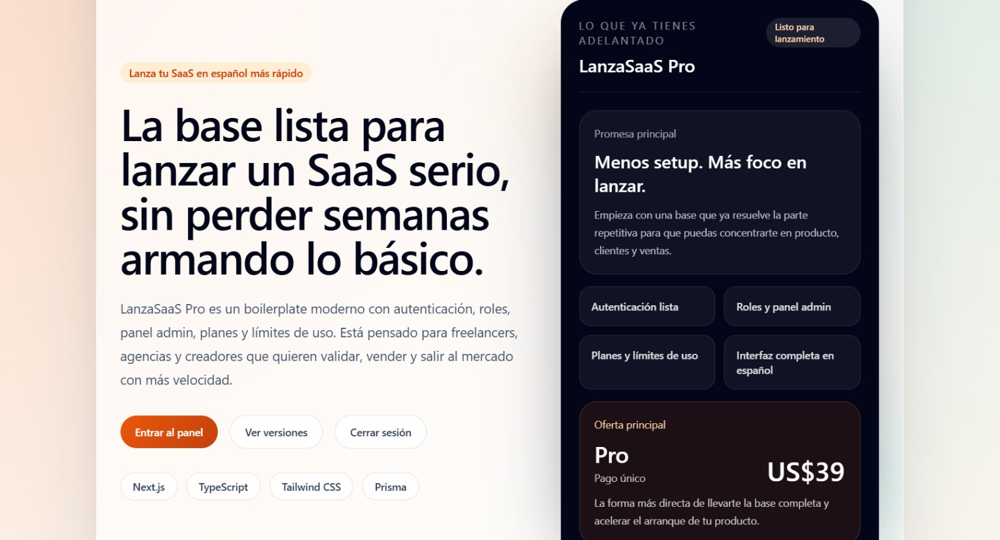
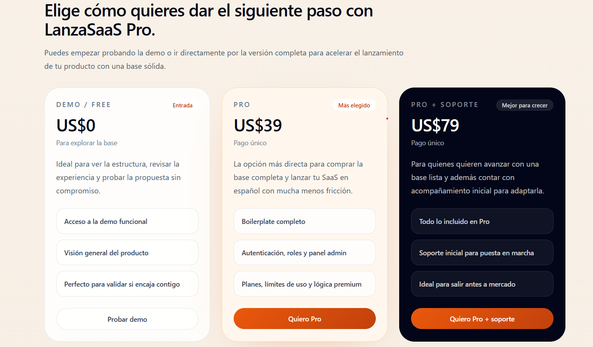
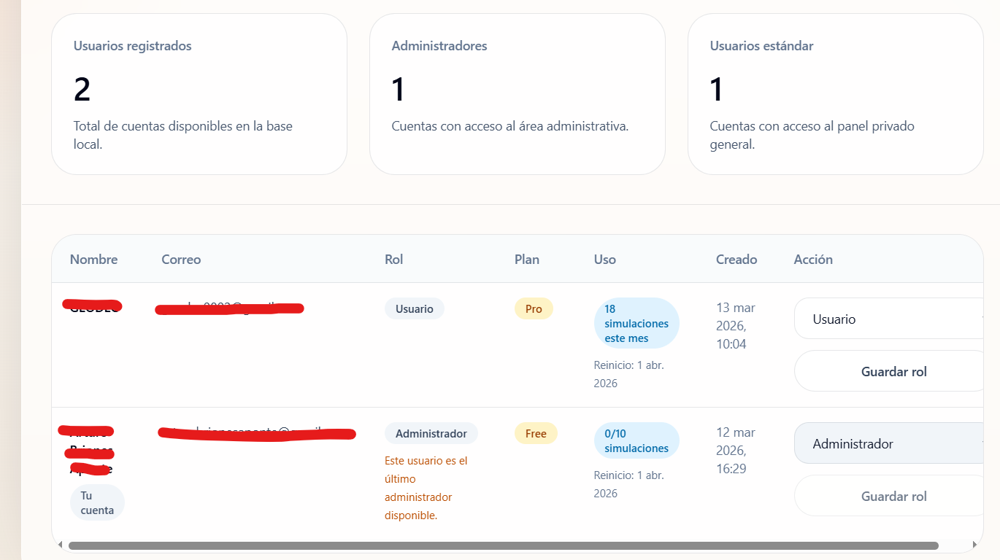

# LanzaSaaS Pro

Boilerplate SaaS en español para lanzar productos más rápido.

LanzaSaaS Pro es una base moderna pensada para freelancers, agencias pequeñas, desarrolladores y creadores que quieren construir un SaaS sin empezar desde cero. Incluye autenticación, recuperación de contraseña, roles, panel admin, planes Free y Pro, límites de uso mensuales y una interfaz lista para adaptar.

## Vista previa





## Compra

Versión Pro disponible aquí:

[Comprar en Gumroad](https://arturobriones.gumroad.com/l/lussbe)

## Qué es

LanzaSaaS Pro te ayuda a ahorrar semanas de trabajo inicial resolviendo desde el inicio lo que más suele frenar un MVP SaaS:

- autenticación completa
- recuperación de contraseña
- panel privado
- roles de usuario y administrador
- administración básica de usuarios
- planes Free y Pro
- lógica premium
- límites de uso por período
- dashboard en español
- base visual moderna y clara

> **Importante:**  
> LanzaSaaS Pro se vende como un **boilerplate completo**, no como acceso a una aplicación cerrada.  
> La lógica de planes Free y Pro está incluida dentro del código como ejemplo funcional para que puedas adaptarla a tu propio producto.

## Para quién es

Este producto está pensado para:

- freelancers que quieren lanzar una herramienta o producto digital
- agencias pequeñas que necesitan una base reutilizable para MVPs
- desarrolladores que quieren acelerar el arranque de un SaaS
- creadores que buscan una experiencia más profesional desde el día uno

## Qué incluye

### Autenticación completa
- registro
- inicio de sesión
- cierre de sesión
- recuperación de contraseña

### Roles y administración
- roles `user` y `admin`
- panel administrativo protegido
- gestión básica de usuarios desde interfaz

### Planes y monetización interna
- plan Free
- plan Pro
- función premium protegida
- mensajes claros de mejora de plan

### Límites de uso
- consumo visible en dashboard
- límite mensual para Free
- uso sin límite práctico para Pro
- reinicio automático por período

### Base técnica
- Next.js
- TypeScript
- Tailwind CSS
- Prisma
- SQLite para entorno local

## Stack

- Next.js
- TypeScript
- Tailwind CSS
- Prisma ORM
- SQLite

## Estado actual

La versión actual ya incluye una base SaaS funcional para demo, personalización y salida rápida a mercado.

### Incluye
- landing comercial
- dashboard privado
- admin básico
- pricing
- lógica Free/Pro
- límites de uso mensuales

### Todavía no incluye
- pagos reales con Stripe
- envío real de correos
- multi-tenant
- equipos u organizaciones
- facturación real

## Demo

La demo permite explorar la estructura general del producto, la experiencia visual y la propuesta del boilerplate.

## Planes

### Demo / Free — US$0
Ideal para explorar la base, revisar la experiencia y validar si encaja contigo.

Incluye:
- acceso a la demo funcional
- visión general del producto
- experiencia base

### Pro — US$39 pago único
La opción más directa para llevarte la base completa y acelerar el arranque de tu producto.

Incluye:
- boilerplate completo
- autenticación
- recuperación de contraseña
- roles y panel admin
- planes y lógica premium
- límites de uso mensuales
- dashboard y estructura visual

### Pro + soporte — US$79 pago único
Pensado para quienes quieren avanzar con una base lista y además contar con acompañamiento inicial.

Incluye:
- todo lo de Pro
- soporte inicial para puesta en marcha
- ayuda para adaptar la base

## Qué problema resuelve

En muchos proyectos SaaS, las primeras semanas se van en construir una y otra vez lo mismo:

- login
- sesiones
- panel privado
- roles
- pricing
- restricciones premium
- límites de uso
- estructura visual

LanzaSaaS Pro reduce esa fricción y te deja concentrarte más rápido en producto, validación y ventas.

## Instalación local

1. Clona o descomprime el proyecto.
2. Copia `.env.example` a `.env`.
3. Revisa el archivo `.env` y asegúrate de que tenga valores válidos.
4. Instala las dependencias:

```bash
npm install

Genera Prisma Client:
npm run db:generate

Ejecuta las migraciones:
npm run db:migrate

Ejecuta las migraciones:
npm run db:migrate

Inicia el proyecto:
npm run dev

Después abre:
http://localhost:3000

Variables de entorno

Asegúrate de tener un archivo .env con valores válidos.

Ejemplo:
DATABASE_URL="file:./dev.db"
AUTH_SECRET="tu_clave_segura"
